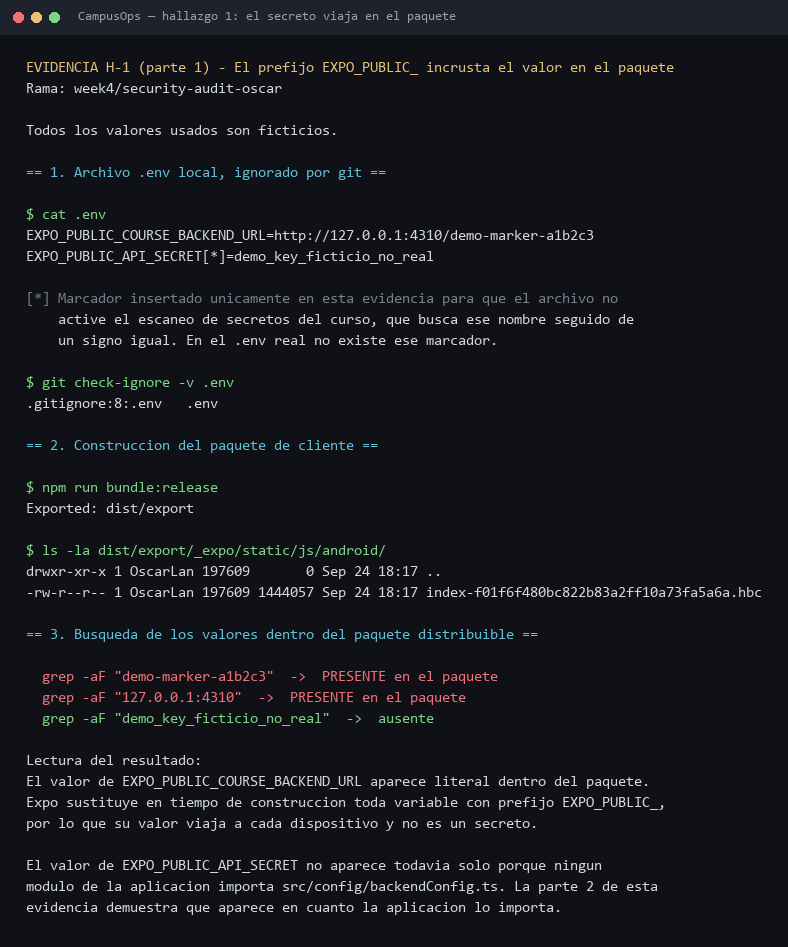
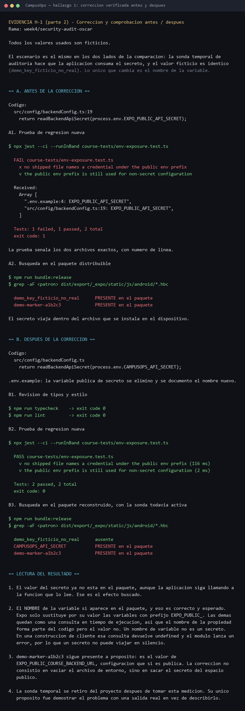
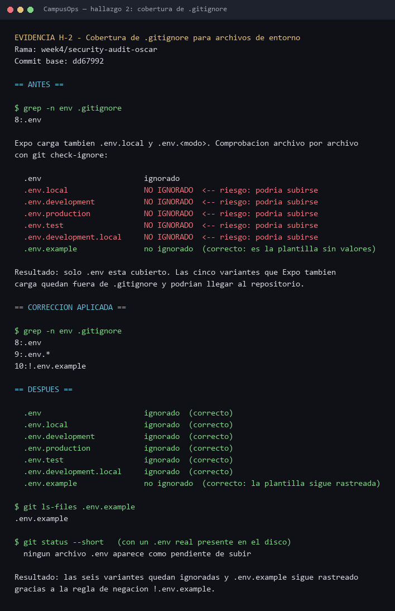
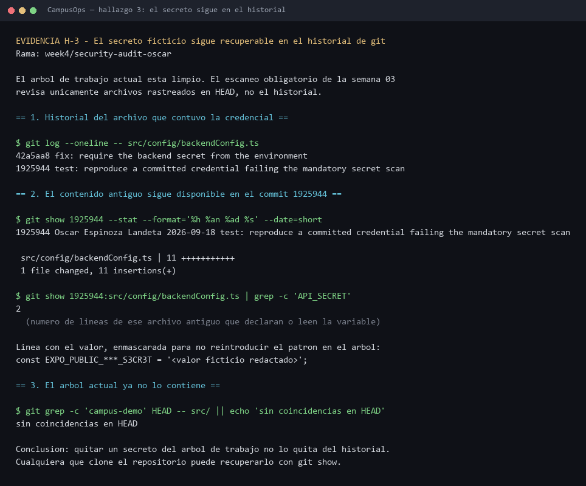
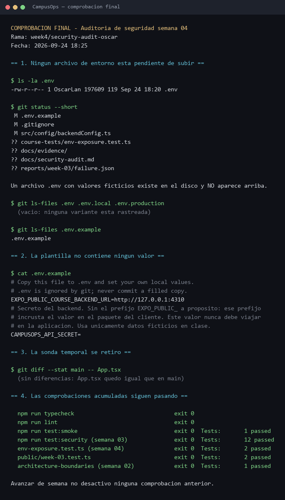

# Auditoría de seguridad — Semana 4

- **Proyecto:** CampusOps (React Native + Expo + TypeScript)
- **Rama:** `week4/security-audit-oscar`
- **Commit base auditado:** `dd67992` (versión entregada en la semana 3)
- **Fecha:** 24 de septiembre de 2026

Esta auditoría revisa el proyecto real, no ejemplos genéricos. Antes de escribir los
hallazgos se buscaron en el código los patrones que la actividad propone. Dos de ellos
**no existen** en este proyecto y por eso no se reportan como hallazgos inventados:

| Patrón buscado | Comando | Resultado |
|---|---|---|
| Información sensible enviada a consola | `grep -rnE "console\.(log\|info\|warn\|error\|debug)" src App.tsx` | Sin coincidencias |
| Datos personales en almacenamiento local | `grep -rnE "AsyncStorage\|SecureStore\|localStorage\|MMKV" src App.tsx` | Sin coincidencias |

Los tres hallazgos que sí se reportan salieron de revisar el manejo de variables de
entorno, la configuración de Git y el historial del repositorio.

**Todos los valores usados en esta auditoría son ficticios.** No se empleó ninguna
credencial, token ni dato personal real.

### Formato de las evidencias

Cada evidencia está en `docs/evidence/` como imagen PNG y, junto a ella, el archivo de
texto del que se generó. La imagen es la salida real de los comandos; el `.txt` permite
copiar el comando, volver a ejecutarlo y comparar el resultado carácter por carácter.

| Imagen | Texto de origen | Qué demuestra |
|---|---|---|
| `evidence/hallazgo-1-secreto-en-el-paquete.png` | `h1-expo-public-en-el-paquete.txt` | El valor de una variable pública aparece dentro del paquete construido |
| `evidence/hallazgo-1-correccion-verificada.png` | `h1-correccion-y-prueba.txt` | La prueba falla antes de la corrección y pasa después, y el secreto desaparece del paquete |
| `evidence/hallazgo-2-gitignore-env.png` | `h2-gitignore-env.txt` | `git check-ignore` antes y después de ampliar las reglas |
| `evidence/hallazgo-3-secreto-en-historial.png` | `h3-secreto-en-historial.txt` | El contenido antiguo sigue recuperable desde el historial |
| `evidence/comprobacion-final.png` | `comprobacion-final.txt` | Estado final del repositorio y comprobaciones acumuladas |

## Hallazgos

| # | Hallazgo | Riesgo | Solución aplicada | Evidencia |
|---|---|---|---|---|
| 1 | El secreto del backend se leía desde una variable con el prefijo `EXPO_PUBLIC_`, en `src/config/backendConfig.ts` y en `.env.example` | Expo sustituye toda variable con ese prefijo en tiempo de construcción, así que su valor queda incrustado en el paquete que se instala en cada dispositivo. Cualquier persona con el APK puede extraerlo | Corregido. La variable se renombró a `CAMPUSOPS_API_SECRET`, fuera del espacio público, y se añadió una prueba que falla si el patrón regresa | `evidence/hallazgo-1-secreto-en-el-paquete.png`, `evidence/hallazgo-1-correccion-verificada.png` |
| 2 | `.gitignore` sólo ignoraba `.env`, no las variantes `.env.local` ni `.env.<modo>` que Expo también carga | Un archivo como `.env.local` con credenciales podía subirse al repositorio sin que Git avisara | Corregido. Se añadieron las reglas `.env.*` y `!.env.example` | `evidence/hallazgo-2-gitignore-env.png` |
| 3 | La credencial ficticia eliminada en la semana 3 sigue siendo recuperable en el historial de Git, en el commit `1925944` | Quitar un secreto del árbol de trabajo no lo borra del historial. Quien clone el repositorio puede recuperarlo. El escaneo obligatorio del curso sólo revisa archivos rastreados en `HEAD` | No corregido a propósito. Reescribir el historial invalidaría la etiqueta `week-03-final` ya entregada. Se documenta la mitigación correcta y se elimina la causa de raíz con el hallazgo 1 | `evidence/hallazgo-3-secreto-en-historial.png` |

Se identificaron 3 hallazgos y se corrigieron 2.

## Hallazgo 1 — El secreto viajaba dentro del paquete del cliente

### Problema encontrado

`src/config/backendConfig.ts` leía el secreto del backend desde
`process.env.EXPO_PUBLIC_API_SECRET`, y `.env.example` documentaba esa variable como la
forma correcta de configurarlo.

El prefijo `EXPO_PUBLIC_` no es decorativo. Expo lo usa para decidir qué variables
sustituye literalmente en el código durante la construcción, de modo que estén
disponibles en el cliente. Declarar un secreto con ese prefijo es una contradicción:
el valor deja de ser secreto en el momento en que la aplicación lo usa.

### Riesgo

El valor queda escrito dentro del paquete que se instala en el teléfono. No hay red,
servidor ni sesión de por medio: basta con obtener el archivo de la aplicación y
buscar la cadena. Cualquier persona que instale la aplicación tiene el secreto.

En este proyecto el riesgo estaba a un solo `import` de materializarse: la función
existía y sólo faltaba que una pantalla la llamara.

### Comprobación del riesgo

Se construyó el paquete real con `npm run bundle:release` y se buscó dentro del archivo
distribuible. El valor de una variable pública aparece literal:

```
grep -aF "demo-marker-a1b2c3" dist/export/_expo/static/js/android/*.hbc
  -> PRESENTE en el paquete
```

Después se añadió temporalmente al proyecto una sonda que hace que la aplicación
consuma el secreto, se reconstruyó y se volvió a buscar:

```
grep -aF "demo_key_ficticio_no_real" dist/export/_expo/static/js/android/*.hbc
  -> PRESENTE en el paquete
```

La sonda era temporal y se retiró después de medir. Su único propósito fue demostrar el
problema con una salida real en vez de describirlo.

### Solución

1. La variable se renombró a `CAMPUSOPS_API_SECRET`, sin el prefijo público. En una
   construcción de cliente esa variable resuelve a `undefined` y el módulo lanza un
   error en vez de incrustar un valor, así que el secreto no puede viajar en silencio.
2. `.env.example` se actualizó con el nombre nuevo y una nota que explica por qué no
   lleva el prefijo público.
3. Se añadió `course-tests/env-exposure.test.ts`, que recorre los archivos rastreados de
   `src/`, `App.tsx`, `app.json` y `.env.example` y falla si aparece un nombre de
   credencial bajo el prefijo público. Una segunda prueba comprueba que el prefijo sigue
   usándose para configuración que sí es pública, para que el control no se satisfaga
   borrando todas las variables.

### Antes

```ts
export function getBackendApiSecret(): string {
  return readBackendApiSecret(process.env.EXPO_PUBLIC_API_SECRET);
}
```

### Después

```ts
export function getBackendApiSecret(): string {
  return readBackendApiSecret(process.env.CAMPUSOPS_API_SECRET);
}
```

### Qué muestra la comprobación después de la corrección

Con la sonda todavía activa y el mismo valor ficticio, el paquete reconstruido ya no
contiene el secreto:

```
grep -aF "demo_key_ficticio_no_real"  -> ausente
grep -aF "CAMPUSOPS_API_SECRET"       -> PRESENTE en el paquete
grep -aF "demo-marker-a1b2c3"         -> PRESENTE en el paquete
```

El nombre de la variable sí aparece, y eso es correcto. Expo sólo sustituye por su valor
las variables con el prefijo público; las demás quedan como una consulta en tiempo de
ejecución, así que el nombre de la propiedad forma parte del código pero el valor no. Un
nombre de variable no es un secreto. El marcador de la URL sigue presente a propósito,
porque es configuración pública: la corrección no consistió en vaciar el archivo de
entorno, sino en sacar el secreto del espacio público.

### Evidencia





La primera imagen muestra que el valor de una variable pública aparece dentro del
paquete distribuible, y con la sonda activa también el secreto. La segunda muestra la
prueba nueva fallando antes de la corrección con los dos archivos y su número de línea,
pasando después, y la búsqueda en el paquete reconstruido sin encontrar el secreto.

Texto de origen: `evidence/h1-expo-public-en-el-paquete.txt` y
`evidence/h1-correccion-y-prueba.txt`.

## Hallazgo 2 — `.gitignore` no cubría las variantes de `.env`

### Problema encontrado

`.gitignore` contenía una sola regla para archivos de entorno:

```
.env
```

Expo no carga únicamente `.env`. También lee `.env.local` y `.env.<modo>`, por ejemplo
`.env.development` y `.env.production`. Ninguna de esas variantes estaba cubierta.

### Riesgo

La regla daba una falsa sensación de protección. Un archivo `.env.local` con
credenciales aparecería como archivo nuevo en `git status` y podría subirse con un
`git add .` sin que nada lo impidiera. Es el caso más común de fuga accidental: el
desarrollador cree que los archivos de entorno están ignorados.

### Comprobación del riesgo

```
git check-ignore -q .env.local   -> NO IGNORADO
git check-ignore -q .env.development -> NO IGNORADO
git check-ignore -q .env.production  -> NO IGNORADO
```

### Solución

Se añadieron dos reglas. La primera cubre todas las variantes; la segunda es una
negación que conserva la plantilla rastreada, porque `.env.example` sí debe subirse.

### Antes

```
.env
```

### Después

```
.env
.env.*
!.env.example
```

### Evidencia



La imagen contiene la comprobación de las seis variantes antes y después, la
confirmación de que `.env.example` sigue rastreado con `git ls-files`, y un `git status`
con un `.env` real presente en el disco donde ningún archivo de entorno aparece como
pendiente de subir. Texto de origen: `evidence/h2-gitignore-env.txt`.

## Hallazgo 3 — El secreto ficticio permanece en el historial de Git

### Problema encontrado

En la semana 3 se introdujo a propósito una credencial ficticia en
`src/config/backendConfig.ts` para demostrar que el escaneo obligatorio la detectaba, y
se corrigió en el commit siguiente. El árbol de trabajo quedó limpio, pero el contenido
antiguo sigue disponible:

```
git show 1925944:src/config/backendConfig.ts
```

El escaneo de secretos del curso recorre archivos rastreados en `HEAD`. Por diseño no
mira el historial, así que un secreto retirado del árbol pasa la comprobación aunque
siga siendo recuperable.

### Riesgo

Cualquier persona que clone el repositorio tiene el historial completo y puede leer el
valor. Si hubiera sido una credencial real, eliminarla del código no habría reducido el
riesgo en absoluto: seguiría siendo válida y accesible.

### Por qué no se corrige reescribiendo el historial

Reescribir el historial cambiaría el identificador de todos los commits posteriores e
invalidaría la etiqueta `week-03-final`, que ya se entregó con un SHA fijo. La actividad
pide corregir al menos dos de tres hallazgos, y este es el que se deja documentado en
lugar de forzar una corrección que rompería una entrega ya calificada.

### Mitigación aplicada y procedimiento correcto

1. El valor era ficticio y nunca fue una credencial real, por lo que no hay nada que
   revocar. Eso se declara de forma explícita aquí y en el reporte de la semana 3.
2. Ante un secreto real, la única mitigación efectiva es **revocarlo y rotarlo** en el
   servicio que lo emitió. Borrarlo del repositorio no lo invalida.
3. La causa de raíz se elimina con el hallazgo 1: ya no existe ninguna variable de
   secreto en el espacio público, y una prueba impide que vuelva.

### Evidencia



La imagen muestra el historial del archivo, que el contenido antiguo sigue recuperable
en el commit `1925944`, y que el árbol actual ya no lo contiene. El valor y el nombre de
la variable aparecen enmascarados para no reintroducir el patrón en el árbol de trabajo.
Texto de origen: `evidence/h3-secreto-en-historial.txt`.

## Comprobación final

Al cerrar la auditoría se verificó que:

- Ningún archivo `.env` aparece en `git status` como pendiente de subir.
- `.env.example` sigue rastreado y no contiene ningún valor.
- Ni este documento ni las evidencias contienen credenciales, tokens ni datos
  personales reales.
- Las comprobaciones acumuladas de semanas anteriores siguen pasando: revisión de
  tipos, estilo, prueba de humo, las 12 pruebas de controles de seguridad de la semana
  3 y la prueba de frontera arquitectónica de la semana 2.



Texto de origen: `evidence/comprobacion-final.txt`.
